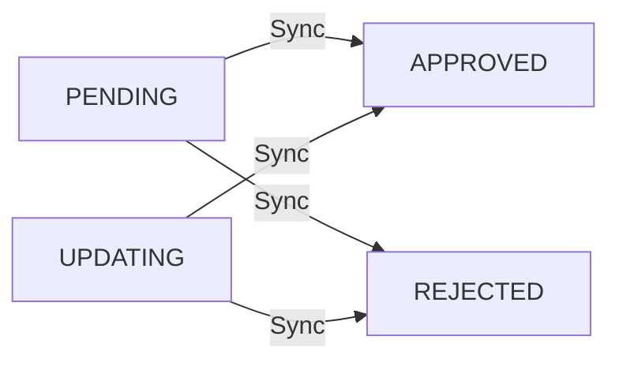

## Overview

Synchronize template statuses from Meta (WhatsApp Business API provider). Updates all pending templates with their current approval status.

<Info>
  This endpoint only syncs templates with `PENDING` status. It fetches the latest status from Meta and updates your local database.
</Info>

---

## How It Works

1. Checks if workspace has any templates with `status: PENDING`
2. Fetches all templates from Meta's API
3. Matches templates by `provider_id`
4. Updates local template statuses (`APPROVED`, `REJECTED`, etc.)

---

## Response

### Success (200 OK)

```json
{
  "success": true,
  "message": "Templates synced successfully"
}
```

### No Pending Templates (404)

```json
{
  "success": false,
  "message": "No pending templates found"
}
```

### Sync Failed (500)

```json
{
  "success": false,
  "message": "Failed to sync the templates"
}
```

---

## When to Use

<CardGroup cols={2}>
  <Card title="After Template Creation" icon="plus">
    Sync after creating templates to check if they've been approved
  </Card>
  <Card title="After Template Update" icon="pen">
    Check status after updating existing templates
  </Card>
  <Card title="Periodic Checks" icon="clock">
    Run periodic syncs (e.g., every 30 minutes) for pending templates
  </Card>
  <Card title="Before Sending Messages" icon="paper-plane">
    Ensure templates are approved before attempting to send
  </Card>
</CardGroup>

---

## Status Transitions



---

## Example Usage

### cURL

```bash
curl -X POST \
  https://lancepilot.com/api/v3/workspaces/{workspace}/templates/sync \
  -H 'Authorization: Bearer YOUR_API_TOKEN'
```

### JavaScript

```javascript
async function syncTemplates(workspaceId) {
  const response = await fetch(
    `https://lancepilot.com/api/v3/workspaces/${workspaceId}/templates/sync`,
    {
      method: 'POST',
      headers: {
        'Authorization': `Bearer ${YOUR_API_TOKEN}`
      }
    }
  );
  
  const data = await response.json();
  console.log(data.message);
}
```

### Python

```python
import requests

def sync_templates(workspace_id, api_token):
    url = f"https://lancepilot.com/api/v3/workspaces/{workspace_id}/templates/sync"
    headers = {"Authorization": f"Bearer {api_token}"}
    
    response = requests.post(url, headers=headers)
    return response.json()
```

---

## Workflow Example

<Steps>
  <Step title="Create Template">
    Create a new template via [POST /templates](/pages/endpoints/templates/add)
    
    Response: `status: "PENDING"`
  </Step>
  
  <Step title="Wait for Review">
    Meta typically reviews templates within 5-30 minutes
  </Step>
  
  <Step title="Sync Status">
    Call sync endpoint to update status
    
    ```bash
    POST /workspaces/{workspace}/templates/sync
    ```
  </Step>
  
  <Step title="Check Result">
    Use [GET /templates](/pages/endpoints/templates/list) to verify new status
    
    Possible results: `APPROVED` or `REJECTED`
  </Step>
</Steps>

---

## Best Practices

<AccordionGroup>
  <Accordion title="Automatic Sync Schedule">
    Set up a background job to sync every 30 minutes:
    
    ```javascript
    setInterval(() => {
      syncTemplates(workspaceId);
    }, 30 * 60 * 1000); // 30 minutes
    ```
  </Accordion>

  <Accordion title="Handle Failures Gracefully">
    ```javascript
    async function syncWithRetry(workspaceId, maxRetries = 3) {
      for (let i = 0; i < maxRetries; i++) {
        try {
          const result = await syncTemplates(workspaceId);
          if (result.success) return result;
        } catch (error) {
          if (i === maxRetries - 1) throw error;
          await new Promise(r => setTimeout(r, 5000)); // Wait 5s
        }
      }
    }
    ```
  </Accordion>

  <Accordion title="Only Sync When Needed">
    Check for pending templates before syncing:
    
    ```javascript
    const templates = await getTemplates(workspaceId);
    const hasPending = templates.some(t => t.status === 'PENDING');
    
    if (hasPending) {
      await syncTemplates(workspaceId);
    }
    ```
  </Accordion>
</AccordionGroup>

---

## Common Issues

<Warning>
  **No Pending Templates**
  
  If you receive a 404 error, it means there are no templates with `PENDING` status to sync. This is not an error condition.
</Warning>

<Warning>
  **Sync Failed (500)**
  
  This usually indicates:
  - Channel connection issues
  - Meta API temporarily unavailable
  - Invalid channel credentials
  
  Solution: Wait a few minutes and try again, or check channel connection status.
</Warning>

---

<Tip>
  **Pro Tip**: Combine sync with webhooks (if available) to get real-time template status updates instead of polling.
</Tip>
